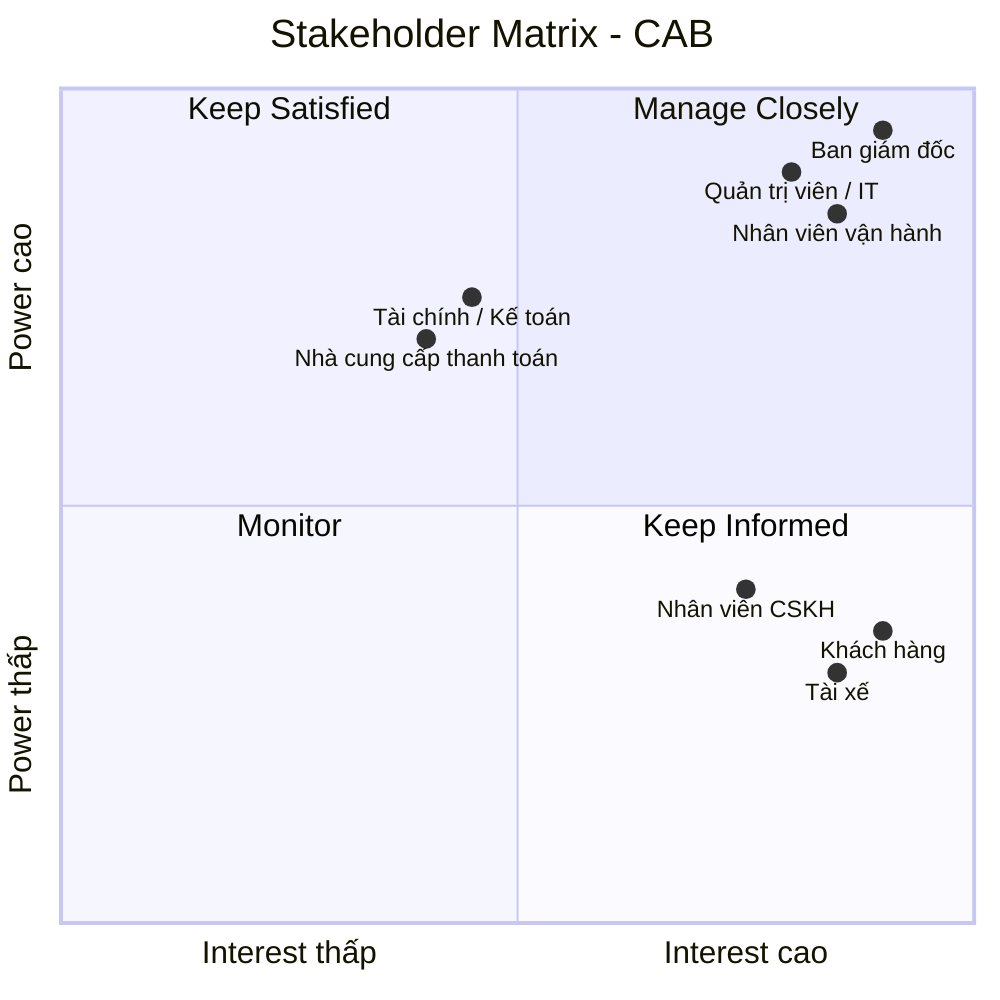

# 23701511_NguyenMinhTan_Cabsystem
## 1. Phân tích nghiệp vụ
### Hệ thống CAB được xây dựng nhằm số hóa và nâng cao hiệu quả toàn bộ quy trình đặt xe, từ khi khách hàng tạo yêu cầu đến khi chuyến đi hoàn thành, thanh toán và đánh giá tài xế. Qua phân tích nghiệp vụ, hệ thống xác định ba nhóm người dùng chính gồm khách hàng, tài xế và nhân viên vận hành, cùng các bên liên quan như ban giám đốc, bộ phận tài chính, chăm sóc khách hàng và các nhà cung cấp dịch vụ bên ngoài. 
### Quy trình nghiệp vụ cốt lõi bao gồm đăng ký và xác thực tài khoản, tạo yêu cầu đặt xe, xác định tài xế phù hợp dựa trên vị trí và trạng thái hoạt động, gửi và xử lý yêu cầu nhận chuyến, theo dõi trạng thái và vị trí chuyến đi, tính cước, thanh toán, thông báo và đánh giá sau chuyến. Hệ thống cần xử lý các trường hợp ngoại lệ như tài xế từ chối hoặc không phản hồi, không tìm được tài xế, thanh toán thất bại hoặc chuyến đi phát sinh sự cố. Bên cạnh các yêu cầu chức năng, hệ thống phải đáp ứng các yêu cầu phi chức năng về khả năng mở rộng, tính sẵn sàng, bảo mật, phân quyền, bảo vệ dữ liệu và ghi nhận nhật ký hoạt động, đồng thời cho phép tích hợp linh hoạt với các dịch vụ thanh toán, bản đồ/GPS và thông báo bên ngoài. 
### Trong quá trình phân tích, BA cũng cần làm rõ các quy tắc nghiệp vụ chưa được xác định như cách tính cước, tiêu chí ưu tiên tài xế, thời gian phản hồi, chính sách hủy chuyến, xử lý mất kết nối và thời gian lưu trữ dữ liệu để đảm bảo giải pháp đáp ứng đúng nhu cầu kinh doanh và có khả năng mở rộng trong tương lai.
## 2. Stakeholder

| # | Stakeholder | Vai trò chính |
|---|---|---|
| 1 | **Ban giám đốc** | Định hướng kinh doanh, phê duyệt phạm vi, ngân sách và mục tiêu hệ thống |
| 2 | **Khách hàng** | Đăng ký, đặt xe, theo dõi chuyến, thanh toán và đánh giá tài xế |
| 3 | **Tài xế** | Nhận/từ chối chuyến, cập nhật trạng thái, vị trí và hoàn thành chuyến |
| 4 | **Nhân viên vận hành** | Theo dõi chuyến, điều phối tài xế và xử lý các trường hợp bất thường |
| 5 | **Nhân viên CSKH** | Hỗ trợ khách hàng, xử lý khiếu nại và tra cứu thông tin chuyến |
| 6 | **Bộ phận tài chính/kế toán** | Quản lý doanh thu, giao dịch, đối soát và báo cáo tài chính |
| 7 | **Quản trị viên hệ thống / IT** | Quản lý tài khoản, phân quyền, bảo mật và vận hành hệ thống |
| 8 | **Nhà cung cấp thanh toán** | Xử lý thanh toán điện tử và trả kết quả giao dịch cho CAB |
## 3. Ma trận Stakeholder CAB

## 4.Business Goals

Hệ thống CAB được xây dựng nhằm số hóa quy trình đặt xe, nâng cao hiệu quả vận hành và cải thiện trải nghiệm khách hàng. Các mục tiêu kinh doanh chính bao gồm:

| ID | Business Goal | Mô tả |
|---|---|---|
| **BG01** | **Số hóa quy trình đặt xe** | Tự động hóa quy trình từ khi khách hàng tạo yêu cầu, tìm tài xế, thực hiện chuyến đến thanh toán và đánh giá. |
| **BG02** | **Tối ưu phân công tài xế** | Tự động tìm và ưu tiên tài xế phù hợp dựa trên vị trí, trạng thái sẵn sàng và các tiêu chí vận hành. |
| **BG03** | **Nâng cao trải nghiệm khách hàng** | Cho phép khách hàng đặt xe, theo dõi trạng thái chuyến, thông tin tài xế, cước phí, thanh toán và đánh giá. |
| **BG04** | **Nâng cao hiệu quả vận hành** | Hỗ trợ nhân viên vận hành theo dõi chuyến, quản lý tài xế và xử lý các trường hợp bất thường. |
| **BG05** | **Quản lý tập trung dữ liệu và giao dịch** | Quản lý tập trung thông tin khách hàng, tài xế, phương tiện, chuyến đi, cước phí và giao dịch. |
| **BG06** | **Đảm bảo khả năng mở rộng** | Xây dựng nền tảng có thể phục vụ số lượng lớn người dùng và dễ dàng mở rộng dịch vụ, thanh toán và thông báo trong tương lai. |
| **BG07** | **Đảm bảo an toàn và ổn định** | Bảo vệ dữ liệu người dùng, kiểm soát quyền truy cập và hạn chế ảnh hưởng khi một thành phần của hệ thống gặp sự cố. |
| **BG08** | **Hỗ trợ quản trị và ra quyết định** | Cung cấp báo cáo về số chuyến, doanh thu, tỷ lệ hoàn thành, tỷ lệ hủy và hiệu quả hoạt động của tài xế. |
## 5. Các module chức năng

Hệ thống CAB được chia thành các module chính nhằm đáp ứng quy trình đặt xe trực tuyến từ khi khách hàng tạo yêu cầu đến khi chuyến đi hoàn thành và thanh toán.

| STT | Module | Mô tả |
|---|---|---|
| **1** | **Quản lý tài khoản** | Đăng ký, đăng nhập, đăng xuất, cập nhật thông tin cá nhân và phân quyền người dùng. |
| **2** | **Quản lý tài xế** | Quản lý hồ sơ tài xế, thông tin phương tiện, trạng thái sẵn sàng và vị trí tài xế. |
| **3** | **Đặt xe** | Cho phép khách hàng nhập điểm đón, điểm đến, lựa chọn loại xe và tạo yêu cầu đặt xe. |
| **4** | **Tìm và phân công tài xế** | Xác định tài xế phù hợp dựa trên vị trí, trạng thái sẵn sàng và các tiêu chí vận hành; xử lý trường hợp tài xế từ chối hoặc không phản hồi. |
| **5** | **Quản lý chuyến đi** | Quản lý và cập nhật trạng thái chuyến từ khi tìm tài xế, tài xế đến điểm đón, đón khách, di chuyển đến khi hoàn thành. |
| **6** | **Tính cước và thanh toán** | Tính số tiền khách hàng phải trả, hỗ trợ thanh toán tiền mặt và thanh toán điện tử thông qua nhà cung cấp bên ngoài. |
| **7** | **Thông báo** | Gửi thông báo đến khách hàng và tài xế về yêu cầu đặt xe, nhận chuyến, thay đổi trạng thái chuyến và kết quả thanh toán. |
| **8** | **Quản trị và vận hành** | Cho phép nhân viên vận hành quản lý khách hàng, tài xế, chuyến đi, xử lý các trường hợp bất thường và theo dõi báo cáo cơ bản. |
## 6. Business Requirements – Yêu cầu nghiệp vụ

Hệ thống CAB cần đáp ứng các yêu cầu nghiệp vụ nhằm đảm bảo toàn bộ quy trình đặt xe trực tuyến được thực hiện từ khi khách hàng tạo yêu cầu, tìm tài xế, thực hiện chuyến, thanh toán đến khi hoàn thành và đánh giá.

### 6.1. Quản lý tài khoản

| ID | Business Requirement |
|---|---|
| **BR01** | Người dùng có thể đăng ký tài khoản trên hệ thống. |
| **BR02** | Người dùng có thể đăng nhập và đăng xuất khỏi hệ thống. |
| **BR03** | Khách hàng có thể cập nhật thông tin cá nhân. |
| **BR04** | Tài xế có thể cập nhật thông tin cá nhân và thông tin phương tiện. |
| **BR05** | Hệ thống phải phân quyền người dùng theo vai trò khách hàng, tài xế và nhân viên vận hành. |

### 6.2. Quản lý tài xế

| ID | Business Requirement |
|---|---|
| **BR06** | Tài xế có thể cập nhật trạng thái hoạt động và trạng thái sẵn sàng nhận chuyến. |
| **BR07** | Hệ thống lưu thông tin phương tiện của tài xế để phục vụ việc phân công chuyến. |
| **BR08** | Hệ thống ghi nhận vị trí của tài xế để hỗ trợ tìm kiếm và theo dõi chuyến đi. |
| **BR09** | Nhân viên vận hành có thể quản lý và kiểm tra thông tin tài xế, phương tiện và trạng thái hoạt động. |

### 6.3. Đặt xe

| ID | Business Requirement |
|---|---|
| **BR10** | Khách hàng có thể tạo yêu cầu đặt xe trực tuyến. |
| **BR11** | Khách hàng phải cung cấp điểm đón và điểm đến khi tạo yêu cầu đặt xe. |
| **BR12** | Khách hàng có thể lựa chọn loại xe/dịch vụ phù hợp với nhu cầu. |
| **BR13** | Hệ thống phải lưu thông tin yêu cầu đặt xe và trạng thái xử lý của yêu cầu. |
| **BR14** | Hệ thống phải thông báo cho khách hàng khi yêu cầu đặt xe được tiếp nhận. |

### 6.4. Tìm và phân công tài xế

| ID | Business Requirement |
|---|---|
| **BR15** | Hệ thống tự động tìm tài xế phù hợp với yêu cầu đặt xe. |
| **BR16** | Hệ thống ưu tiên tài xế đang sẵn sàng và có vị trí phù hợp/gần khách hàng. |
| **BR17** | Hệ thống gửi thông báo yêu cầu nhận chuyến đến tài xế phù hợp. |
| **BR18** | Tài xế có thể chấp nhận hoặc từ chối yêu cầu chuyến. |
| **BR19** | Nếu tài xế từ chối hoặc không phản hồi, hệ thống phải tiếp tục tìm tài xế khác. |
| **BR20** | Khách hàng không phải tạo lại yêu cầu khi hệ thống chuyển sang tìm tài xế khác. |
| **BR21** | Nếu không tìm được tài xế phù hợp, hệ thống phải thông báo rõ ràng cho khách hàng. |

### 6.5. Quản lý chuyến đi

| ID | Business Requirement |
|---|---|
| **BR22** | Khách hàng có thể theo dõi trạng thái chuyến đi sau khi đặt xe thành công. |
| **BR23** | Khách hàng có thể xem thông tin tài xế đã nhận chuyến. |
| **BR24** | Hệ thống cung cấp thời gian dự kiến tài xế đến điểm đón. |
| **BR25** | Tài xế có thể cập nhật trạng thái chuyến đi. |
| **BR26** | Chuyến đi phải hỗ trợ các trạng thái: đang tìm tài xế, đã nhận chuyến, đã đến điểm đón, đã đón khách, đang di chuyển và hoàn thành. |
| **BR27** | Hệ thống lưu lại thông tin và lịch sử trạng thái của chuyến đi. |
| **BR28** | Khách hàng có thể xem lịch sử các chuyến đã thực hiện. |

### 6.6. Tính cước và thanh toán

| ID | Business Requirement |
|---|---|
| **BR29** | Hệ thống phải xác định số tiền khách hàng phải trả sau khi chuyến đi hoàn thành. |
| **BR30** | Hệ thống tính cước dựa trên loại dịch vụ và thông tin chuyến đi theo chính sách của doanh nghiệp. |
| **BR31** | Khách hàng có thể thanh toán bằng tiền mặt. |
| **BR32** | Khách hàng có thể thanh toán bằng phương thức thanh toán điện tử. |
| **BR33** | Hệ thống phải tích hợp với nhà cung cấp thanh toán bên ngoài để xử lý giao dịch điện tử. |
| **BR34** | Hệ thống không được lưu trực tiếp thông tin nhạy cảm của thẻ hoặc tài khoản thanh toán. |
| **BR35** | Hệ thống phải thông báo kết quả thanh toán cho khách hàng. |
| **BR36** | Khi thanh toán điện tử thất bại, hệ thống phải cho phép xử lý lại theo chính sách của doanh nghiệp. |

### 6.7. Thông báo

| ID | Business Requirement |
|---|---|
| **BR37** | Hệ thống phải thông báo cho khách hàng khi yêu cầu đặt xe được tiếp nhận. |
| **BR38** | Hệ thống phải thông báo cho khách hàng khi có tài xế nhận chuyến. |
| **BR39** | Hệ thống phải thông báo khi tài xế đến điểm đón. |
| **BR40** | Hệ thống phải thông báo khi chuyến đi hoàn thành. |
| **BR41** | Hệ thống phải thông báo kết quả thanh toán cho khách hàng. |
| **BR42** | Hệ thống phải thông báo cho tài xế khi có chuyến mới hoặc có thay đổi liên quan đến chuyến đang thực hiện. |
| **BR43** | Hệ thống phải được thiết kế để có thể bổ sung thêm các kênh thông báo trong tương lai. |

### 6.8. Quản trị và vận hành

| ID | Business Requirement |
|---|---|
| **BR44** | Nhân viên vận hành có thể xem và theo dõi các chuyến đang diễn ra. |
| **BR45** | Nhân viên vận hành có thể kiểm tra trạng thái hoạt động của tài xế. |
| **BR46** | Nhân viên vận hành có thể quản lý thông tin khách hàng, tài xế và phương tiện. |
| **BR47** | Nhân viên vận hành có thể tra cứu lịch sử chuyến đi và giao dịch. |
| **BR48** | Nhân viên vận hành có thể hỗ trợ xử lý các trường hợp chuyến đi bị lỗi hoặc bất thường. |
| **BR49** | Hệ thống phải phân quyền các chức năng quản trị để hạn chế nhân viên thực hiện các thao tác nhạy cảm. |
| **BR50** | Hệ thống phải cung cấp báo cáo cơ bản về số lượng chuyến, doanh thu, tỷ lệ hoàn thành, tỷ lệ hủy và hiệu quả hoạt động của tài xế. |
| **BR51** | Hệ thống phải lưu vết các thao tác quan trọng của người dùng và nhân viên để phục vụ kiểm tra khi có sự cố. |
