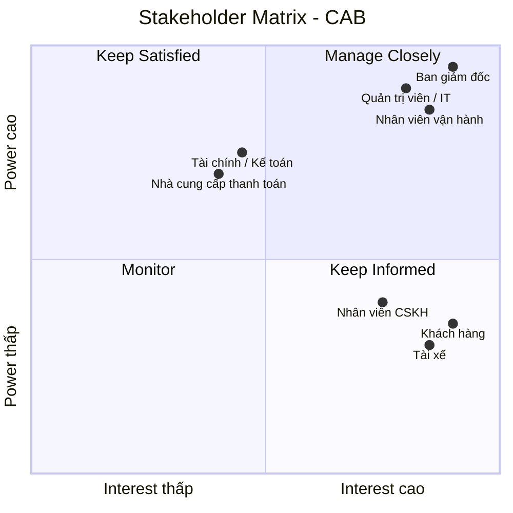

# 23701511_NguyenMinhTan_Cabsystem
### Hệ thống CAB được xây dựng nhằm số hóa và nâng cao hiệu quả toàn bộ quy trình đặt xe, từ khi khách hàng tạo yêu cầu đến khi chuyến đi hoàn thành, thanh toán và đánh giá tài xế. Qua phân tích nghiệp vụ, hệ thống xác định ba nhóm người dùng chính gồm khách hàng, tài xế và nhân viên vận hành, cùng các bên liên quan như ban giám đốc, bộ phận tài chính, chăm sóc khách hàng và các nhà cung cấp dịch vụ bên ngoài. 
### Quy trình nghiệp vụ cốt lõi bao gồm đăng ký và xác thực tài khoản, tạo yêu cầu đặt xe, xác định tài xế phù hợp dựa trên vị trí và trạng thái hoạt động, gửi và xử lý yêu cầu nhận chuyến, theo dõi trạng thái và vị trí chuyến đi, tính cước, thanh toán, thông báo và đánh giá sau chuyến. Hệ thống cần xử lý các trường hợp ngoại lệ như tài xế từ chối hoặc không phản hồi, không tìm được tài xế, thanh toán thất bại hoặc chuyến đi phát sinh sự cố. Bên cạnh các yêu cầu chức năng, hệ thống phải đáp ứng các yêu cầu phi chức năng về khả năng mở rộng, tính sẵn sàng, bảo mật, phân quyền, bảo vệ dữ liệu và ghi nhận nhật ký hoạt động, đồng thời cho phép tích hợp linh hoạt với các dịch vụ thanh toán, bản đồ/GPS và thông báo bên ngoài. 
### Trong quá trình phân tích, BA cũng cần làm rõ các quy tắc nghiệp vụ chưa được xác định như cách tính cước, tiêu chí ưu tiên tài xế, thời gian phản hồi, chính sách hủy chuyến, xử lý mất kết nối và thời gian lưu trữ dữ liệu để đảm bảo giải pháp đáp ứng đúng nhu cầu kinh doanh và có khả năng mở rộng trong tương lai.
## Stakeholder

| # | Stakeholder | Vai trò chính |
|---|---|---|
| 1 | **Ban giám đốc** | Định hướng kinh doanh, phê duyệt phạm vi, ngân sách và mục tiêu hệ thống |
| 2 | **Khách hàng** | Đăng ký, đặt xe, theo dõi chuyến, thanh toán và đánh giá tài xế |
| 3 | **Tài xế** | Nhận/từ chối chuyến, cập nhật trạng thái, vị trí và hoàn thành chuyến |
| 4 | **Nhân viên vận hành** | Theo dõi chuyến, điều phối tài xế và xử lý các trường hợp bất thường |
| 5 | **Nhân viên CSKH** | Hỗ trợ khách hàng, xử lý khiếu nại và tra cứu thông tin chuyến |
| 6 | **Bộ phận tài chính/kế toán** | Quản lý doanh thu, giao dịch, đối soát và báo cáo tài chính |
| 7 | **Quản trị viên hệ thống / IT** | Quản lý tài khoản, phân quyền, bảo mật và vận hành hệ thống |
| 8 | **Nhà cung cấp thanh toán** | Xử lý thanh toán điện tử và trả kết quả giao dịch cho CAB |
## Ma trận Stakeholder CAB

# CAB - Business Analysis

## 1. Project Overview

## 2. Business Goals

## 3. Stakeholders

## 4. Stakeholder Matrix

## 5. Business Scope
### In Scope
### Out of Scope

## 6. Actors

## 7. Business Process

## 8. Functional Requirements

## 9. Non-Functional Requirements

## 10. Business Rules

## 11. Exception / Alternative Flows

## 12. External Systems & Integrations

## 13. Assumptions & Constraints

## 14. Open Questions
