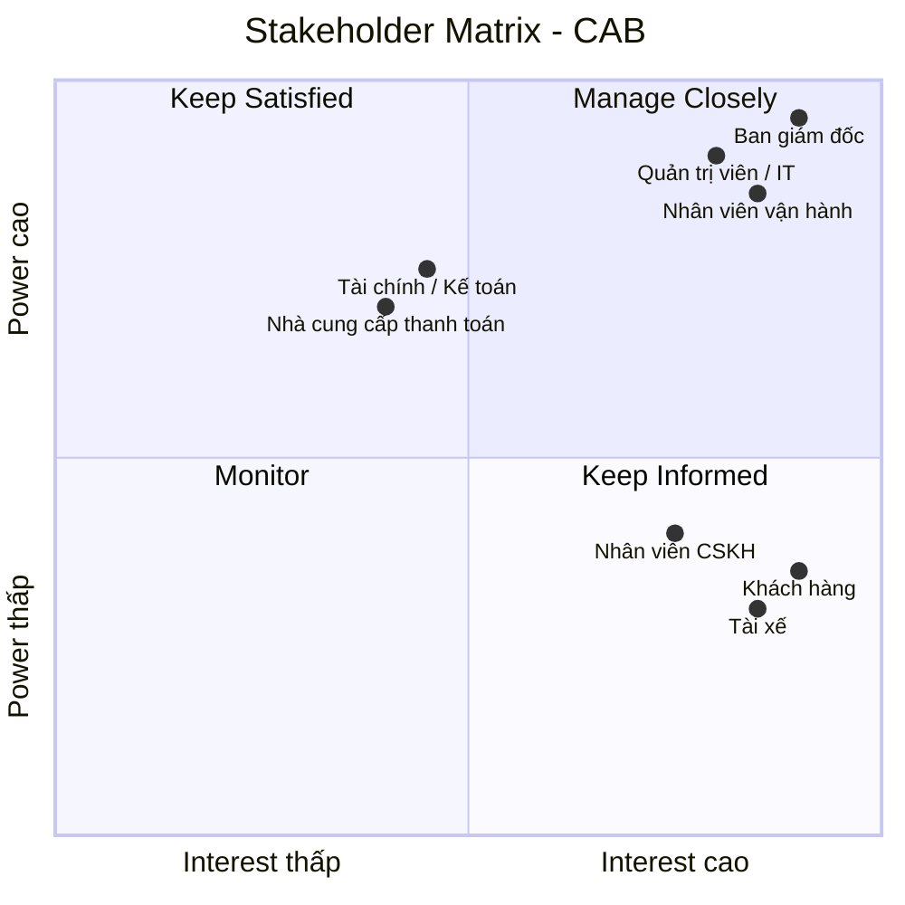

# 23701511_NguyenMinhTan_Cabsystem
## 1. Phân tích nghiệp vụ
### Hệ thống CAB được xây dựng nhằm số hóa và nâng cao hiệu quả toàn bộ quy trình đặt xe, từ khi khách hàng tạo yêu cầu đến khi chuyến đi hoàn thành, thanh toán và đánh giá tài xế. Qua phân tích nghiệp vụ, hệ thống xác định ba nhóm người dùng chính gồm khách hàng, tài xế và nhân viên vận hành, cùng các bên liên quan như ban giám đốc, bộ phận tài chính, chăm sóc khách hàng và các nhà cung cấp dịch vụ bên ngoài. 
### Quy trình nghiệp vụ cốt lõi bao gồm đăng ký và xác thực tài khoản, tạo yêu cầu đặt xe, xác định tài xế phù hợp dựa trên vị trí và trạng thái hoạt động, gửi và xử lý yêu cầu nhận chuyến, theo dõi trạng thái và vị trí chuyến đi, tính cước, thanh toán, thông báo và đánh giá sau chuyến. Hệ thống cần xử lý các trường hợp ngoại lệ như tài xế từ chối hoặc không phản hồi, không tìm được tài xế, thanh toán thất bại hoặc chuyến đi phát sinh sự cố. Bên cạnh các yêu cầu chức năng, hệ thống phải đáp ứng các yêu cầu phi chức năng về khả năng mở rộng, tính sẵn sàng, bảo mật, phân quyền, bảo vệ dữ liệu và ghi nhận nhật ký hoạt động, đồng thời cho phép tích hợp linh hoạt với các dịch vụ thanh toán, bản đồ/GPS và thông báo bên ngoài. 
### Trong quá trình phân tích, BA cũng cần làm rõ các quy tắc nghiệp vụ chưa được xác định như cách tính cước, tiêu chí ưu tiên tài xế, thời gian phản hồi, chính sách hủy chuyến, xử lý mất kết nối và thời gian lưu trữ dữ liệu để đảm bảo giải pháp đáp ứng đúng nhu cầu kinh doanh và có khả năng mở rộng trong tương lai.
## 2. Stakeholder

| # | Stakeholder | Vai trò chính |
|---|---|---|
| 1 | **Ban giám đốc** | Định hướng kinh doanh, phê duyệt phạm vi, ngân sách và mục tiêu hệ thống |
| 2 | **Khách hàng** | Đăng ký, đặt xe, theo dõi chuyến, thanh toán và đánh giá tài xế |
| 3 | **Tài xế** | Nhận/từ chối chuyến, cập nhật trạng thái, vị trí và hoàn thành chuyến |
| 4 | **Nhân viên vận hành** | Theo dõi chuyến, điều phối tài xế và xử lý các trường hợp bất thường |
| 5 | **Nhân viên CSKH** | Hỗ trợ khách hàng, xử lý khiếu nại và tra cứu thông tin chuyến |
| 6 | **Bộ phận tài chính/kế toán** | Quản lý doanh thu, giao dịch, đối soát và báo cáo tài chính |
| 7 | **Quản trị viên hệ thống / IT** | Quản lý tài khoản, phân quyền, bảo mật và vận hành hệ thống |
| 8 | **Nhà cung cấp thanh toán** | Xử lý thanh toán điện tử và trả kết quả giao dịch cho CAB |
## 3. Ma trận Stakeholder CAB

## 4.Business Goals

Hệ thống CAB được xây dựng nhằm số hóa quy trình đặt xe, nâng cao hiệu quả vận hành và cải thiện trải nghiệm khách hàng. Các mục tiêu kinh doanh chính bao gồm:

| ID | Business Goal | Mô tả |
|---|---|---|
| **BG01** | **Số hóa quy trình đặt xe** | Tự động hóa quy trình từ khi khách hàng tạo yêu cầu, tìm tài xế, thực hiện chuyến đến thanh toán và đánh giá. |
| **BG02** | **Tối ưu phân công tài xế** | Tự động tìm và ưu tiên tài xế phù hợp dựa trên vị trí, trạng thái sẵn sàng và các tiêu chí vận hành. |
| **BG03** | **Nâng cao trải nghiệm khách hàng** | Cho phép khách hàng đặt xe, theo dõi trạng thái chuyến, thông tin tài xế, cước phí, thanh toán và đánh giá. |
| **BG04** | **Nâng cao hiệu quả vận hành** | Hỗ trợ nhân viên vận hành theo dõi chuyến, quản lý tài xế và xử lý các trường hợp bất thường. |
| **BG05** | **Quản lý tập trung dữ liệu và giao dịch** | Quản lý tập trung thông tin khách hàng, tài xế, phương tiện, chuyến đi, cước phí và giao dịch. |
| **BG06** | **Đảm bảo khả năng mở rộng** | Xây dựng nền tảng có thể phục vụ số lượng lớn người dùng và dễ dàng mở rộng dịch vụ, thanh toán và thông báo trong tương lai. |
| **BG07** | **Đảm bảo an toàn và ổn định** | Bảo vệ dữ liệu người dùng, kiểm soát quyền truy cập và hạn chế ảnh hưởng khi một thành phần của hệ thống gặp sự cố. |
| **BG08** | **Hỗ trợ quản trị và ra quyết định** | Cung cấp báo cáo về số chuyến, doanh thu, tỷ lệ hoàn thành, tỷ lệ hủy và hiệu quả hoạt động của tài xế. |
## 5. Các module chức năng

Hệ thống CAB được chia thành các module chính nhằm đáp ứng quy trình đặt xe trực tuyến từ khi khách hàng tạo yêu cầu đến khi chuyến đi hoàn thành và thanh toán.

| STT | Module | Mô tả |
|---|---|---|
| **1** | **Quản lý tài khoản** | Đăng ký, đăng nhập, đăng xuất, cập nhật thông tin cá nhân và phân quyền người dùng. |
| **2** | **Quản lý tài xế** | Quản lý hồ sơ tài xế, thông tin phương tiện, trạng thái sẵn sàng và vị trí tài xế. |
| **3** | **Đặt xe** | Cho phép khách hàng nhập điểm đón, điểm đến, lựa chọn loại xe và tạo yêu cầu đặt xe. |
| **4** | **Tìm và phân công tài xế** | Xác định tài xế phù hợp dựa trên vị trí, trạng thái sẵn sàng và các tiêu chí vận hành; xử lý trường hợp tài xế từ chối hoặc không phản hồi. |
| **5** | **Quản lý chuyến đi** | Quản lý và cập nhật trạng thái chuyến từ khi tìm tài xế, tài xế đến điểm đón, đón khách, di chuyển đến khi hoàn thành. |
| **6** | **Tính cước và thanh toán** | Tính số tiền khách hàng phải trả, hỗ trợ thanh toán tiền mặt và thanh toán điện tử thông qua nhà cung cấp bên ngoài. |
| **7** | **Thông báo** | Gửi thông báo đến khách hàng và tài xế về yêu cầu đặt xe, nhận chuyến, thay đổi trạng thái chuyến và kết quả thanh toán. |
| **8** | **Quản trị và vận hành** | Cho phép nhân viên vận hành quản lý khách hàng, tài xế, chuyến đi, xử lý các trường hợp bất thường và theo dõi báo cáo cơ bản. |
## 6. Business Requirements – Yêu cầu nghiệp vụ

Hệ thống CAB cần đáp ứng các yêu cầu nghiệp vụ cốt lõi nhằm hỗ trợ toàn bộ quy trình đặt xe trực tuyến, từ quản lý người dùng, tạo yêu cầu đặt xe, tìm và phân công tài xế, thực hiện chuyến đi, tính cước, thanh toán đến đánh giá sau chuyến.

### 6.1. Quản lý tài khoản

| ID | Business Requirement | Mô tả |
|---|---|---|
| **BR01** | Đăng ký tài khoản | Người dùng có thể tạo tài khoản để sử dụng các chức năng của hệ thống. |
| **BR02** | Đăng nhập và đăng xuất | Người dùng có thể đăng nhập để sử dụng hệ thống và đăng xuất khi kết thúc phiên làm việc. |
| **BR03** | Cập nhật thông tin cá nhân | Khách hàng và tài xế có thể cập nhật các thông tin cá nhân cần thiết. |
| **BR04** | Phân quyền người dùng | Hệ thống phân biệt quyền truy cập giữa khách hàng, tài xế và nhân viên vận hành. |

### 6.2. Quản lý tài xế

| ID | Business Requirement | Mô tả |
|---|---|---|
| **BR05** | Quản lý thông tin tài xế | Hệ thống lưu trữ và quản lý thông tin hồ sơ của tài xế. |
| **BR06** | Quản lý phương tiện | Tài xế có thể cung cấp và cập nhật thông tin phương tiện được sử dụng để phục vụ chuyến đi. |
| **BR07** | Quản lý trạng thái tài xế | Tài xế có thể chuyển sang trạng thái sẵn sàng hoặc không sẵn sàng nhận chuyến. |
| **BR08** | Theo dõi vị trí tài xế | Hệ thống ghi nhận vị trí tài xế đang hoạt động để hỗ trợ tìm và phân công chuyến. |

### 6.3. Đặt xe

| ID | Business Requirement | Mô tả |
|---|---|---|
| **BR09** | Tạo yêu cầu đặt xe | Khách hàng có thể tạo yêu cầu đặt xe trực tuyến. |
| **BR10** | Nhập điểm đón và điểm đến | Khách hàng phải cung cấp điểm đón và điểm đến để hệ thống xác định chuyến đi. |
| **BR11** | Lựa chọn loại xe | Khách hàng có thể lựa chọn loại xe/dịch vụ phù hợp với nhu cầu. |
| **BR12** | Quản lý yêu cầu đặt xe | Hệ thống lưu thông tin và trạng thái của yêu cầu đặt xe trong suốt quá trình xử lý. |
| **BR13** | Hủy yêu cầu đặt xe | Khách hàng có thể hủy yêu cầu đặt xe theo chính sách của doanh nghiệp. |

### 6.4. Tìm và phân công tài xế

| ID | Business Requirement | Mô tả |
|---|---|---|
| **BR14** | Tự động tìm tài xế | Hệ thống tự động tìm tài xế phù hợp với yêu cầu đặt xe. |
| **BR15** | Ưu tiên tài xế phù hợp | Hệ thống ưu tiên tài xế đang sẵn sàng và có vị trí phù hợp/gần điểm đón. |
| **BR16** | Gửi yêu cầu nhận chuyến | Hệ thống gửi thông tin chuyến đến tài xế phù hợp để tài xế quyết định nhận hoặc từ chối. |
| **BR17** | Chấp nhận hoặc từ chối chuyến | Tài xế có thể chấp nhận hoặc từ chối yêu cầu chuyến. |
| **BR18** | Tìm tài xế thay thế | Nếu tài xế từ chối hoặc không phản hồi, hệ thống tiếp tục tìm tài xế khác mà khách hàng không cần tạo lại yêu cầu. |
| **BR19** | Thông báo không tìm được tài xế | Nếu không tìm được tài xế phù hợp, hệ thống phải thông báo rõ ràng cho khách hàng. |

### 6.5. Quản lý và theo dõi chuyến đi

| ID | Business Requirement | Mô tả |
|---|---|---|
| **BR20** | Xem thông tin tài xế | Sau khi tài xế nhận chuyến, khách hàng có thể xem thông tin tài xế và phương tiện. |
| **BR21** | Theo dõi trạng thái chuyến | Khách hàng có thể theo dõi trạng thái chuyến đi từ lúc đặt xe đến khi hoàn thành. |
| **BR22** | Dự kiến thời gian tài xế đến | Hệ thống cung cấp thời gian dự kiến tài xế đến điểm đón. |
| **BR23** | Cập nhật trạng thái chuyến | Tài xế có thể cập nhật trạng thái chuyến trong quá trình thực hiện. |
| **BR24** | Quản lý vòng đời chuyến đi | Hệ thống quản lý các trạng thái chính: tìm tài xế, đã nhận chuyến, đã đến điểm đón, đã đón khách, đang di chuyển và hoàn thành. |
| **BR25** | Lưu thông tin chuyến đi | Hệ thống lưu thông tin chuyến để phục vụ theo dõi, tra cứu và quản lý. |
| **BR26** | Xem lịch sử chuyến | Khách hàng có thể xem lại các chuyến đi đã thực hiện và thông tin liên quan. |

### 6.6. Tính cước và thanh toán

| ID | Business Requirement | Mô tả |
|---|---|---|
| **BR27** | Tính cước chuyến đi | Hệ thống xác định số tiền khách hàng phải trả dựa trên loại dịch vụ và thông tin chuyến đi. |
| **BR28** | Thanh toán tiền mặt | Khách hàng có thể thanh toán bằng tiền mặt theo chính sách của doanh nghiệp. |
| **BR29** | Thanh toán điện tử | Khách hàng có thể thanh toán bằng phương thức thanh toán điện tử. |
| **BR30** | Tích hợp nhà cung cấp thanh toán | Hệ thống kết nối với nhà cung cấp thanh toán bên ngoài để xử lý giao dịch điện tử. |
| **BR31** | Xử lý thanh toán thất bại | Khi giao dịch thất bại, hệ thống thông báo cho khách hàng và cho phép xử lý lại theo chính sách. |
| **BR32** | Quản lý giao dịch | Hệ thống lưu thông tin giao dịch để phục vụ tra cứu và đối soát. |

### 6.7. Thông báo

| ID | Business Requirement | Mô tả |
|---|---|---|
| **BR33** | Thông báo yêu cầu đặt xe | Hệ thống thông báo cho khách hàng khi yêu cầu đặt xe được tiếp nhận. |
| **BR34** | Thông báo nhận chuyến | Hệ thống thông báo cho khách hàng khi tài xế nhận chuyến và thông báo cho tài xế khi có chuyến mới. |
| **BR35** | Thông báo trạng thái chuyến | Hệ thống thông báo các thay đổi quan trọng trong quá trình thực hiện chuyến. |
| **BR36** | Thông báo hoàn thành chuyến | Hệ thống thông báo cho khách hàng khi chuyến đi hoàn thành. |
| **BR37** | Thông báo thanh toán | Hệ thống thông báo kết quả thanh toán cho khách hàng. |

### 6.8. Quản trị và vận hành

| ID | Business Requirement | Mô tả |
|---|---|---|
| **BR38** | Quản lý khách hàng và tài xế | Nhân viên vận hành có thể xem và quản lý thông tin khách hàng, tài xế và phương tiện. |
| **BR39** | Theo dõi hoạt động | Nhân viên vận hành có thể theo dõi trạng thái tài xế và các chuyến đang diễn ra. |
| **BR40** | Tra cứu lịch sử | Nhân viên vận hành có thể tra cứu lịch sử chuyến đi và giao dịch. |
| **BR41** | Xử lý trường hợp bất thường | Nhân viên vận hành có thể hỗ trợ và xử lý các trường hợp chuyến đi bị lỗi hoặc phát sinh vấn đề. |
| **BR42** | Phân quyền quản trị | Hệ thống giới hạn quyền thực hiện các thao tác nhạy cảm đối với từng nhóm nhân viên. |
| **BR43** | Báo cáo hoạt động | Hệ thống cung cấp báo cáo cơ bản về số lượng chuyến, doanh thu, tỷ lệ hoàn thành và tỷ lệ hủy. |

### 6.9. Đánh giá chuyến đi

| ID | Business Requirement | Mô tả |
|---|---|---|
| **BR44** | Đánh giá tài xế | Sau khi chuyến đi hoàn thành, khách hàng có thể đánh giá tài xế bằng số sao. |
| **BR45** | Nhận xét về chuyến đi | Khách hàng có thể để lại nhận xét về tài xế hoặc chuyến đi. |
| **BR46** | Lưu kết quả đánh giá | Hệ thống lưu kết quả đánh giá để phục vụ quản lý chất lượng dịch vụ. |
## 7. Functional Requirements – Yêu cầu chức năng

Các Business Requirements được phân rã thành các yêu cầu chức năng cụ thể mà hệ thống cần thực hiện.

### 7.1. Quản lý tài khoản

| ID | Business Requirement | Functional Requirement |
|---|---|---|
| **FR01.1** | BR01 – Đăng ký tài khoản | Hệ thống cho phép người dùng nhập thông tin cần thiết để tạo tài khoản. |
| **FR01.2** | BR01 – Đăng ký tài khoản | Hệ thống kiểm tra thông tin đăng ký và đảm bảo tài khoản không bị trùng. |
| **FR02.1** | BR02 – Đăng nhập | Hệ thống cho phép người dùng nhập thông tin xác thực để đăng nhập. |
| **FR02.2** | BR02 – Đăng nhập | Hệ thống kiểm tra thông tin xác thực và chỉ cho phép truy cập khi hợp lệ. |
| **FR02.3** | BR02 – Đăng xuất | Hệ thống cho phép người dùng đăng xuất khỏi tài khoản. |
| **FR03.1** | BR03 – Cập nhật thông tin | Hệ thống cho phép khách hàng cập nhật thông tin cá nhân. |
| **FR03.2** | BR03 – Cập nhật thông tin | Hệ thống lưu thông tin cá nhân sau khi cập nhật hợp lệ. |
| **FR04.1** | BR04 – Phân quyền | Hệ thống xác định vai trò của người dùng sau khi đăng nhập. |
| **FR04.2** | BR04 – Phân quyền | Hệ thống chỉ cho phép người dùng truy cập các chức năng phù hợp với vai trò. |

### 7.2. Quản lý tài xế

| ID | Business Requirement | Functional Requirement |
|---|---|---|
| **FR05.1** | BR05 – Quản lý tài xế | Hệ thống cho phép lưu và quản lý thông tin hồ sơ tài xế. |
| **FR06.1** | BR06 – Quản lý phương tiện | Tài xế có thể thêm và cập nhật thông tin phương tiện. |
| **FR07.1** | BR07 – Trạng thái tài xế | Tài xế có thể chuyển trạng thái sang sẵn sàng hoặc không sẵn sàng nhận chuyến. |
| **FR07.2** | BR07 – Trạng thái tài xế | Hệ thống chỉ đưa tài xế đang sẵn sàng vào danh sách tìm kiếm chuyến. |
| **FR08.1** | BR08 – Vị trí tài xế | Hệ thống nhận và cập nhật vị trí hiện tại của tài xế. |
| **FR08.2** | BR08 – Vị trí tài xế | Hệ thống sử dụng vị trí tài xế để phục vụ việc tìm kiếm và phân công chuyến. |

### 7.3. Đặt xe

| ID | Business Requirement | Functional Requirement |
|---|---|---|
| **FR09.1** | BR09 – Tạo yêu cầu đặt xe | Hệ thống cho phép khách hàng tạo yêu cầu đặt xe. |
| **FR10.1** | BR10 – Điểm đón/điểm đến | Hệ thống cho phép khách hàng nhập điểm đón và điểm đến. |
| **FR10.2** | BR10 – Điểm đón/điểm đến | Hệ thống kiểm tra điểm đón và điểm đến trước khi tạo yêu cầu. |
| **FR11.1** | BR11 – Lựa chọn loại xe | Hệ thống hiển thị các loại xe/dịch vụ đang được hỗ trợ. |
| **FR11.2** | BR11 – Lựa chọn loại xe | Khách hàng có thể lựa chọn loại xe khi đặt chuyến. |
| **FR12.1** | BR12 – Quản lý yêu cầu | Hệ thống tạo mã chuyến và lưu thông tin yêu cầu đặt xe. |
| **FR12.2** | BR12 – Quản lý yêu cầu | Hệ thống cập nhật trạng thái yêu cầu trong quá trình xử lý. |
| **FR13.1** | BR13 – Hủy yêu cầu | Khách hàng có thể hủy yêu cầu theo trạng thái và chính sách cho phép. |

### 7.4. Tìm và phân công tài xế

Đây là **chức năng quan trọng nhất của hệ thống CAB**, vì nó quyết định yêu cầu đặt xe có được kết nối với tài xế hay không.

| ID | Business Requirement | Functional Requirement |
|---|---|---|
| **FR14.1** | BR14 – Tự động tìm tài xế | Hệ thống xác định vị trí hiện tại của khách hàng từ thông tin điểm đón. |
| **FR14.2** | BR14 – Tự động tìm tài xế | Hệ thống lấy danh sách các tài xế đang hoạt động và sẵn sàng nhận chuyến. |
| **FR14.3** | BR14 – Tự động tìm tài xế | Hệ thống chỉ lựa chọn tài xế có loại phương tiện phù hợp với yêu cầu của khách hàng. |
| **FR14.4** | BR14 – Tự động tìm tài xế | Hệ thống loại bỏ các tài xế không đủ điều kiện nhận chuyến. |
| **FR15.1** | BR15 – Ưu tiên tài xế | Hệ thống tính khoảng cách giữa tài xế và điểm đón. |
| **FR15.2** | BR15 – Ưu tiên tài xế | Hệ thống có thể ưu tiên tài xế dựa trên khoảng cách đến khách hàng. |
| **FR15.3** | BR15 – Ưu tiên tài xế | Hệ thống có thể sử dụng các tiêu chí vận hành khác như trạng thái và mức độ phù hợp để xếp thứ tự tài xế. |
| **FR16.1** | BR16 – Gửi yêu cầu nhận chuyến | Hệ thống gửi thông tin yêu cầu chuyến đến tài xế được lựa chọn. |
| **FR16.2** | BR16 – Gửi yêu cầu nhận chuyến | Thông tin gửi cho tài xế bao gồm điểm đón, điểm đến, loại xe và thông tin cần thiết của chuyến. |
| **FR17.1** | BR17 – Nhận/từ chối chuyến | Tài xế có thể chấp nhận yêu cầu chuyến. |
| **FR17.2** | BR17 – Nhận/từ chối chuyến | Tài xế có thể từ chối yêu cầu chuyến. |
| **FR18.1** | BR18 – Tìm tài xế thay thế | Hệ thống theo dõi thời gian phản hồi của tài xế. |
| **FR18.2** | BR18 – Tìm tài xế thay thế | Nếu tài xế từ chối, hệ thống chuyển sang tài xế phù hợp tiếp theo. |
| **FR18.3** | BR18 – Tìm tài xế thay thế | Nếu tài xế không phản hồi trong thời gian quy định, hệ thống chuyển sang tài xế khác. |
| **FR18.4** | BR18 – Tìm tài xế thay thế | Hệ thống không tạo yêu cầu đặt xe mới khi chuyển sang tài xế khác. |
| **FR19.1** | BR19 – Không tìm được tài xế | Hệ thống xác định khi không còn tài xế phù hợp để thử. |
| **FR19.2** | BR19 – Không tìm được tài xế | Hệ thống cập nhật trạng thái yêu cầu và thông báo cho khách hàng không tìm được tài xế. |

### 7.5. Quản lý và theo dõi chuyến đi

| ID | Business Requirement | Functional Requirement |
|---|---|---|
| **FR20.1** | BR20 – Thông tin tài xế | Hệ thống hiển thị thông tin tài xế sau khi tài xế nhận chuyến. |
| **FR20.2** | BR20 – Thông tin tài xế | Hệ thống hiển thị thông tin phương tiện của tài xế. |
| **FR21.1** | BR21 – Theo dõi chuyến | Khách hàng có thể xem trạng thái hiện tại của chuyến đi. |
| **FR21.2** | BR21 – Theo dõi chuyến | Hệ thống cập nhật trạng thái chuyến khi tài xế thực hiện các bước của chuyến. |
| **FR22.1** | BR22 – Thời gian dự kiến | Hệ thống xác định khoảng cách giữa tài xế và điểm đón. |
| **FR22.2** | BR22 – Thời gian dự kiến | Hệ thống cung cấp thời gian dự kiến tài xế đến điểm đón. |
| **FR23.1** | BR23 – Cập nhật trạng thái | Tài xế có thể cập nhật trạng thái đã đến điểm đón. |
| **FR23.2** | BR23 – Cập nhật trạng thái | Tài xế có thể cập nhật trạng thái đã đón khách. |
| **FR23.3** | BR23 – Cập nhật trạng thái | Tài xế có thể cập nhật trạng thái đang di chuyển. |
| **FR23.4** | BR23 – Cập nhật trạng thái | Tài xế có thể cập nhật trạng thái hoàn thành chuyến. |
| **FR24.1** | BR24 – Vòng đời chuyến | Hệ thống quản lý thứ tự chuyển đổi giữa các trạng thái chuyến. |
| **FR24.2** | BR24 – Vòng đời chuyến | Hệ thống không cho phép chuyển sang trạng thái không hợp lệ. |
| **FR25.1** | BR25 – Lưu thông tin chuyến | Hệ thống lưu thông tin khách hàng, tài xế, điểm đón, điểm đến, trạng thái và thời gian của chuyến. |
| **FR26.1** | BR26 – Lịch sử chuyến | Khách hàng có thể xem danh sách các chuyến đã hoàn thành. |
| **FR26.2** | BR26 – Lịch sử chuyến | Khách hàng có thể xem chi tiết từng chuyến và số tiền phải trả. |

### 7.6. Tính cước và thanh toán

| ID | Business Requirement | Functional Requirement |
|---|---|---|
| **FR27.1** | BR27 – Tính cước | Hệ thống xác định số tiền phải trả khi chuyến đi hoàn thành. |
| **FR27.2** | BR27 – Tính cước | Hệ thống sử dụng loại xe/dịch vụ và thông tin chuyến để tính cước. |
| **FR28.1** | BR28 – Thanh toán tiền mặt | Hệ thống ghi nhận trạng thái thanh toán tiền mặt của chuyến. |
| **FR29.1** | BR29 – Thanh toán điện tử | Hệ thống tạo yêu cầu thanh toán thông qua nhà cung cấp thanh toán. |
| **FR29.2** | BR29 – Thanh toán điện tử | Hệ thống nhận và cập nhật kết quả giao dịch từ nhà cung cấp thanh toán. |
| **FR30.1** | BR30 – Tích hợp thanh toán | Hệ thống giao tiếp với nhà cung cấp thanh toán thông qua giao diện tích hợp. |
| **FR30.2** | BR30 – Tích hợp thanh toán | Hệ thống không lưu thông tin nhạy cảm của thẻ hoặc tài khoản thanh toán. |
| **FR31.1** | BR31 – Thanh toán thất bại | Hệ thống ghi nhận trạng thái giao dịch thất bại. |
| **FR31.2** | BR31 – Thanh toán thất bại | Hệ thống thông báo cho khách hàng khi thanh toán không thành công. |
| **FR31.3** | BR31 – Thanh toán thất bại | Hệ thống cho phép thực hiện lại thanh toán theo chính sách doanh nghiệp. |
| **FR32.1** | BR32 – Quản lý giao dịch | Hệ thống lưu mã giao dịch, số tiền, thời gian và trạng thái thanh toán để tra cứu. |

### 7.7. Thông báo

| ID | Business Requirement | Functional Requirement |
|---|---|---|
| **FR33.1** | BR33 – Thông báo đặt xe | Hệ thống gửi thông báo khi yêu cầu đặt xe được tiếp nhận. |
| **FR34.1** | BR34 – Thông báo nhận chuyến | Hệ thống thông báo cho khách hàng khi tài xế nhận chuyến. |
| **FR34.2** | BR34 – Thông báo nhận chuyến | Hệ thống thông báo cho tài xế khi có yêu cầu chuyến phù hợp. |
| **FR35.1** | BR35 – Thông báo trạng thái | Hệ thống gửi thông báo khi trạng thái chuyến thay đổi ở các mốc quan trọng. |
| **FR36.1** | BR36 – Thông báo hoàn thành | Hệ thống thông báo cho khách hàng khi chuyến đi hoàn thành. |
| **FR37.1** | BR37 – Thông báo thanh toán | Hệ thống thông báo kết quả thanh toán cho khách hàng. |

### 7.8. Quản trị và vận hành

| ID | Business Requirement | Functional Requirement |
|---|---|---|
| **FR38.1** | BR38 – Quản lý dữ liệu | Nhân viên vận hành có thể tra cứu thông tin khách hàng, tài xế và chuyến đi. |
| **FR39.1** | BR39 – Theo dõi hoạt động | Nhân viên vận hành có thể xem danh sách các chuyến đang diễn ra. |
| **FR39.2** | BR39 – Theo dõi hoạt động | Nhân viên vận hành có thể xem trạng thái hoạt động của tài xế. |
| **FR40.1** | BR40 – Tra cứu lịch sử | Nhân viên vận hành có thể tìm kiếm và xem lịch sử chuyến đi và giao dịch. |
| **FR41.1** | BR41 – Xử lý bất thường | Nhân viên vận hành có thể xem và xử lý các chuyến có trạng thái bất thường. |
| **FR42.1** | BR42 – Phân quyền | Hệ thống kiểm tra quyền trước khi cho phép thực hiện chức năng quản trị. |
| **FR43.1** | BR43 – Báo cáo | Hệ thống cung cấp số lượng chuyến, doanh thu, tỷ lệ hoàn thành và tỷ lệ hủy. |

### 7.9. Đánh giá chuyến đi

| ID | Business Requirement | Functional Requirement |
|---|---|---|
| **FR44.1** | BR44 – Đánh giá tài xế | Hệ thống cho phép khách hàng đánh giá tài xế sau khi chuyến hoàn thành. |
| **FR44.2** | BR44 – Đánh giá tài xế | Khách hàng có thể lựa chọn số sao đánh giá. |
| **FR45.1** | BR45 – Nhận xét | Khách hàng có thể nhập nhận xét về tài xế hoặc chuyến đi. |
| **FR46.1** | BR46 – Lưu đánh giá | Hệ thống lưu kết quả đánh giá gắn với chuyến đi và tài xế. |
## 8. Use Case Diagram
B9. Đặc tả usecase
B10 Phân tích quy trình nghiệp vụ

